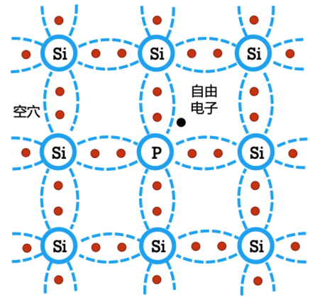
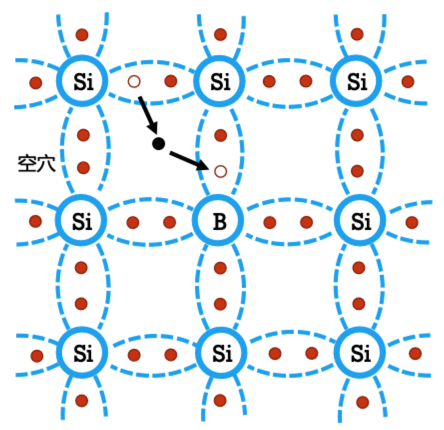
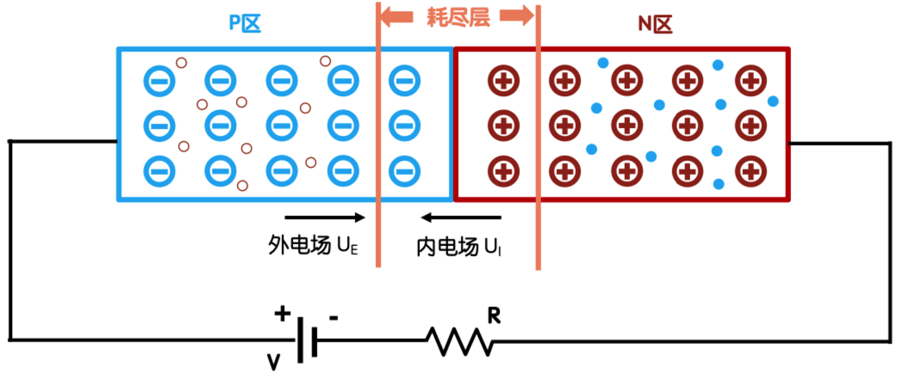
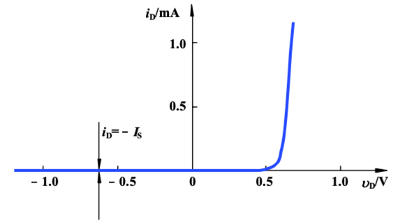

# 半导体基础

1. 本征半导体

   - 本征半导体是纯净的晶体结构的半导体。
   - 本征激发：价电子由于热运动获得足够的能量，从共价键中挣脱成为自由电子。
   - 复合：自由电子在运动过程中与空穴相遇并填补空穴的现象叫做复合。

2. N型半导体

   - 掺入5价P元素。

   - 自由电子为多子，空穴为少子，杂质原子为施主原子，以电子导电为主。

     

3. P型半导体

   - 掺入3价B元素。

   - 空穴为多子，自由电子为少子，杂质原子为受主原子，以空穴导电为主。

     

4. PN结

   - 正向偏置

   - PN结导通

     

   - 截止

     

   - PN结的电流方程
     - $i_D=i_s[e^{\frac{V_D}{V_T}}-1]$
     - $i_s$：反向饱和电流
     - $V_T=\frac{kT}{q}, k=1.38\times 10^{-23J/K}$
     - T=300K，$V_T$=26mV

   - PN结的正向特性

     - 当PN结的正向电压$V_D\gg V_T: i_D\approx i_se^{\frac{V_D}{V_T}}$

       

   - PN结的反向击穿特性
     - 当PN结的反向电压$\lvert V_D\rvert\gg V_T: i_D\approx-i_s$
     - 反向击穿
       - 齐纳击穿：高掺杂，耗尽层宽度窄，不大的反向电压就可在耗尽层形成很强的电场，使得共价键里的电子脱离共价键的束缚，产生电子-空穴对。温度越高，击穿电压越低。
       - 雪崩击穿：低掺杂，耗尽层宽度宽，反向电压很大时使得参加漂移运动的少子速度增大，使得少子与共价键里的电子产生碰撞，产生电子-空穴对。温度越高，击穿电压越高。

   - PN结的电容效应
     - 势垒电容：$C_b$，外加反向电压变化。
     - 扩散电容：$C_d$，外加正向电压变化。
     - 结电容：$C_j=C_b+C_d$，高频信号
